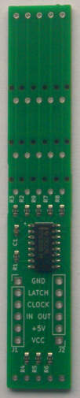
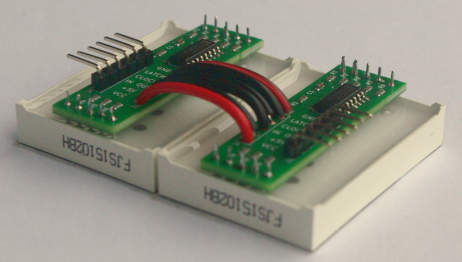
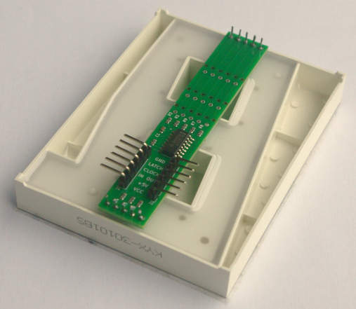

# 7Backpack

7Backpack is a shift register based led driver similar to [SparkFun Large Digit Driver](https://www.sparkfun.com/products/13279) but with a nicer form factor.

It has been designed to fit directly at the back of common anode 7-segments displays. Four sizes are supported : 1.5" (15101BS), 1.8" (18011BH), 2.3" (23011BH) and 3" (30101BS).

  

## Features

This board is functionnaly identical to SparkFun Large Digit Driver. Exact same code found at [Spakfun tutorial](https://learn.sparkfun.com/tutorials/large-digit-driver-hookup-guide/all) can be used without any modification.

The size of the board can be adjusted to match the size of the display. The PCB has pre-cut lines to snap unneeded pieces of the board.

## Manufacturing

See directory `Gerber/` for production files and bill of materials.

## License

Copyleft 2024 - Nicolas AGIUS

Creative Commons - Attribution-NonCommercial-ShareAlike 4.0 International (CC BY-NC-SA 4.0)

